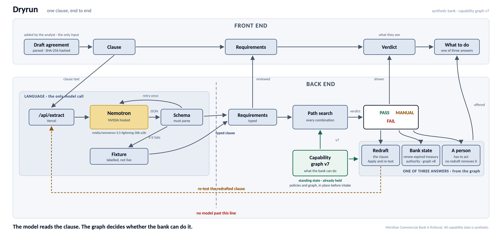

# Dryrun — dry-run the loan before you sign

Dryrun checks a draft loan agreement, clause by clause, against what the bank
can actually do, and says `PASS`, `MANUAL` or `FAIL` before anyone signs.

**Demo video:** TODO — link goes here

**Live demo:** https://loan-operability.vercel.app

**Source:** https://github.com/ethantran12345/loan-operability

**The problem.** A bank negotiates a bespoke loan clause with a borrower: "up to
EUR 40 million, same day, if you tell us by 11:00 A.M." Nobody knows until late
whether the bank's own systems, cutoff times, booking entities and approvals can
actually deliver what the clause promises. The facts needed to check it are
spread across operations procedures and an approvals register that the people
drafting the clause do not read. Finding out after signing, when the borrower
asks for the money, is expensive.

[](docs/flow-diagram.png)

*One clause, end to end: the model reads the clause, the graph decides whether the bank can do it.*

> **Nemotron understands the language. Our system owns the institution's verified
> operating state and deterministically proves whether a complete execution path
> exists.**

## See it work in 60 seconds

1. Open the [live demo](https://loan-operability.vercel.app).
2. Click **Load the sample agreement**, then **Run dry run**.
3. Four cards come back, one per borrowing clause: `FAIL`, `MANUAL`, `PASS`,
   `FAIL`, each labelled `Live Nemotron` or `Cached`.
4. Open the first card, §2.03(a). It shows the agreement's 40,000,000 against the
   bank's 25,000,000, with both passages. Press **Apply and re-test**: the
   redrafted terms return `PASS`.
5. Open the last card, §2.03(c), and press **Change the bank's approved state to
   v8 and re-check**. The same clause moves from `FAIL` to `MANUAL`, because the
   only thing that changed is an approval the bank renewed.

## What works, and what doesn't

**Runs today.** The live app reads a draft agreement, Nemotron turns each
borrowing clause into typed terms, and code with no model call tests them
against the bank's limits: 32 routes for a same-day draw, 14 checks on each,
224 tests. Every finding shows the agreement's words beside the bank's policy
and says what to do.

**The real limits.**

- **Synthetic data only.** The bank, the agreement and the policies are
  invented.
- **One file format.** It reads the `.md` packet layout only. No PDF, no Word,
  no scans, no tables or footnotes. Anything else is refused with the reason,
  not guessed at.
- **It checks the clauses it is told to check.** The four borrowing clauses are
  named by hand. The other 28 paragraphs are displayed but not checked. It does
  not find the risky clauses for you.
- **The bank's list is written by hand.** The app confirms each listed value
  appears in the cited policy. It cannot notice a rule that is in a policy but
  missing from the list.
- **One sample bank, one kind of promise.** Everything shown is about drawing
  money and giving notice. The interest and fee checks exist in code and tests
  but no sample clause uses them.
- **Free-tier model access.** It rate-limits, and the app then falls back to a
  cached extraction, labelled `Cached` on the card. A cached extraction only
  describes the sample's wording. For your own agreement, only a live call
  describes your text.
- **The re-test is not sign-off.** It lives in the browser, the agreement file
  is unchanged, and the agreement's own result does not move when a re-test
  passes.
- **Nothing is saved.** No accounts, no database. The only lasting output is the
  JSON file from **Export record**.
- **No validation against real practitioner review.** Nobody who does this work
  at a bank has checked the bank model or the verdicts.

All bank data in this repository is synthetic. Nothing here describes any real
institution's operations, and nothing here is legal or financial advice.

---

## What Nemotron does, and what it does not

The model is **NVIDIA Nemotron 3.5 Lightning 30B A3B**
(`nvidia/nemotron-3.5-lightning-30b-a3b`), called through NVIDIA's hosted API.
It has one job: turn a clause written in legal English into a filled-in form
[structured extraction], because the checking code needs numbers and names, not
prose.

**What we send.** One clause at a time: its id, its section number and its exact
text, read out of the agreement file. With it go fixed instructions: write down
only what the clause says, leave a field blank when the clause is silent, and
list every gap. We do not send the bank's policies, the bank's limits or the
other clauses, and we never ask for a verdict. The prompt is in
`src/lib/extract.ts`.

**What comes back.** A form [JSON] with the operation, currency, amount,
settlement day, notice deadline and its timezone, lending office, delivery
channel, what the notice must contain, and a list of anything the clause left
unclear.

**How it is checked.** The reply must fit a fixed shape [a Zod schema,
`src/domain/schema.ts`], because the checking code accepts only that shape. It
must also survive seven plain checks that stop the model filling gaps with
guesses. For example, a timezone is rejected unless the clause's own words name
it, because a guessed timezone would change the verdict. If a reply fails, we
send it back **once** with the reason. If the second reply fails too, or the
call is slow or errors, we use a saved recording of a real earlier reply and
label the card `Cached`. The tests for all of this are in
`src/lib/__tests__/extract.test.ts`.

**What it never does.** It never decides `PASS`, `MANUAL` or `FAIL`. The code
that decides (`src/domain/evaluate.ts`) makes no model call. It also cannot
change the clause it was asked to read: the clause text on screen is copied from
the file, never from the model's reply.

## How the verdict is decided

The bank's limits live in a hand-written list [the capability registry,
`src/fixtures/capability-graph.v7.json`]: 15 things the bank can do, 4 approval
authorities and 3 lending offices. Each entry carries its limits, for example
"same-day EUR funding: up to EUR 25,000,000, notice by 09:30 London time".

To fund a draw the bank has to do three things in a row: take in the notice,
fund the money inside a funding window, and book the loan at an office. One
choice for each of the three is a **route** [a capability path]. The checking
code builds every possible route, 32 of them for a same-day draw, and runs 14
checks [comparators] on each one: currency, amount, cutoff time, office, channel,
notice contents, approvals and so on.

**Why one complete route, not a pile of facts.** Separate facts can each be true
and still not add up to something the bank can do. The bank can fund USD 50
million same day, and it can fund EUR same day, but it cannot fund EUR 50
million same day, because the higher limit belongs to the USD window. So a
clause has to fit one route from start to finish. `evaluate.test.ts` has the
tests: "will not lend the USD limit to a EUR draw" and "will not pair a EUR
funding window with a Toronto booking entity".

The verdict follows from the routes:

- `PASS`: at least one complete route passes every check.
- `MANUAL`: no route passes without help, but one would if a named person acts.
- `FAIL`: every route breaks at least one hard limit.

If the clause leaves something out, the answer is `MANUAL`, never `PASS`, because
we will not mark a promise deliverable on a guess. The agreement's overall
result is its worst clause.

## How we tested the claim

We gave the same clause and the same capability graph to the same model, with no
engine, and had the engine grade the answer (`src/domain/challenge.ts`). The
grader compares:

- the model's verdict against the engine's;
- the paths it listed against the engine's exhaustive set of complete paths;
- its verdict on each real path against the engine's verdict on that path;
- every number in its proposed fix against the values the graph actually holds;
- the assumptions it declared, plus any the grader detects;
- run-to-run consistency.

The point is method, not intelligence. The model may well reach the right
verdict, and when it does the scorecard says so.

## The three answers a finding can give

Every finding that is not a `PASS` says what to do about it, in one of three
ways (`src/lib/resolution.ts`, tested in `resolution.test.ts`).

**Redraft the clause.** §2.03(a) promises up to EUR 40,000,000 same day, notice
by 11:00 A.M. with no timezone, through any lending office. The bank's same-day
EUR window is EUR 25,000,000, 09:30 London time, booked in London. The redraft
changes five terms (amount, cutoff, office, delivery channel, notice contents).
Every new value is copied from the bank's list, never made up by a model, and
the redrafted terms re-test to `PASS` (`repair.test.ts`).

**Change the bank's state.** §2.03(c) asks for EUR 20,000,000 same day through
New York. Every term fits the bank's New York exception window. But that window
needs Treasury's approval, and Treasury's authority to give it expired on 31
August 2026, before the 22 September 2026 transaction date. No wording fixes
that, so no redraft is offered. Under capabilities version 8, where Treasury
renewed the authority from 15 September 2026, the same clause becomes `MANUAL`
(`benchmark.test.ts`).

**A person has to act.** §2.02(c) lets the borrower send notices by email. The
bank accepts an emailed notice only after loan operations authenticate it with a
callback against the authorised-signatory list, within one business day. The finding names that step, its owner
and its time allowance, and says: "Refer to loan operations before signing. No
drafting change removes this step."

## What is real and what is synthetic

**Invented:**

- The bank. "Meridian Commercial Bank" does not exist.
- The credit agreement, the three operating procedures and the approvals
  register in `src/packet/`. I wrote them for this project.
- The bank's list of limits and approvals. It is hand-written, not taken from
  any real bank and not generated from the policy documents.
- The transaction date (22 September 2026) and the choice of which four clauses
  to check. Both are set by hand in `src/fixtures/agreement.json`.

**Real:**

- **The extraction.** A card labelled `Live Nemotron` came from a call made in
  your session. A card labelled `Cached` shows a recording of a real reply from
  the same model, recorded on 2026-09-19, that passed the same checks
  (`src/fixtures/extractions.json`).
- **The evaluation.** The route search and the 14 checks run in your browser on
  every run. No verdict is stored anywhere.
- **The timings.** The seconds shown for a live call are what the server
  measured of its own call.
- **The hashes.** Every file is fingerprinted [SHA-256] from its actual bytes
  when it is read, and **Export record** writes those fingerprints out.
- **The policy quotes.** Each passage shown beside a finding is found in the
  policy file at run time, not pasted in by hand.

One thing is staged: the pace at which a card reveals its result. The checking
is already finished by then, and the status line says "real output, paced for
reading".

## Choices I made, and why

**The model extracts but never decides.** A language model can give a different
answer to the same question twice, and it cannot show that it looked at every
route. A bank needs the same answer every time and a reason it can check. So the
model does the part it is good at, reading legal English, and ordinary code does
the deciding. The verdict is worked out from the extracted terms by code that
makes no model call, and the same terms always produce the same fingerprint
(`evaluate.test.ts`, "is stable for identical inputs").

**A cached extraction is labelled, not hidden.** The free NVIDIA endpoint is
sometimes slow or rate-limited, so the demo needs a fallback or it can stall.
But if I showed a recording as though it were live, you could not trust anything
else on the screen. So the card says `Live Nemotron` only when this session's
own call produced what you see, and `Cached` otherwise, and the call log in Demo
tools shows no call where none was made (`callLog.test.ts`). If you drop in an
agreement whose clause reads differently from the recorded one, the card says
`Cached · not this text` (`extractClient.test.ts`).

**An approval can never make a clause pass automatically.** An approval is a
person agreeing to something in the future. The register can show that Treasury
is *allowed* to sign off, but not that Treasury *will*. So in the code a route
that needs an approval can only come back `FAIL` (the authority is expired, too
small, or not independent) or `MANUAL` (the authority is valid, go and get the
sign-off). There is no `PASS` outcome in that check (`approvalComparator` in
`src/domain/comparators.ts`). That is why renewing Treasury's authority moves
§2.03(c) to `MANUAL`, not to `PASS`.

**The policies are already in the app, not uploaded.** A bank's procedures exist
before any deal does, and the analyst checking a draft is not the person who
owns them. So the app opens with the policies in force already loaded and listed
by id and version, and the analyst adds only the draft agreement
(`intake.test.ts`). There is a second reason. An upload box for policies would
suggest the app reads rules out of policy prose, and it does not. What it does
is check that each value in the bank's list appears word for word in the policy
section it cites: 16 entries verify and 4 point at procedures that are not in
this packet (`documents.test.ts`).

**A missing timezone is tested, not just flagged.** "11:00 A.M." with no
timezone could mean London, New York or Toronto. The code tries all three of the
bank's offices. If all three miss the cutoff the clause fails, because no
reading rescues it. If they disagree it is `MANUAL`, because the answer depends
on the missing fact. §2.03(a) misses 09:30 London under every reading, so it is
a `FAIL`, not an open question.

## Running it locally

```
npm install
npm run dev      # serves the app, /api/extract and /api/challenge together
npm test         # 224 tests
npm run typecheck
npm run build
```

The app works fully with `NVIDIA_API_KEY` unset: `/api/extract` serves the cached
fixtures and the UI labels them as such. To try the live path, put
`NVIDIA_API_KEY=...` in `.env.local` (gitignored) and restart `npm run dev`.

## Team

- Ethan Tran — solo hacker — [ethantran1000@gmail.com](mailto:ethantran1000@gmail.com)

## Hackathon build provenance

This repository was created for SteelHacks XIII after hacking began at 11:00 AM
EDT on September 19, 2026. The first commit is timestamped September 19, 2026 at
1:33 PM EDT. The agreement, bank capability data, and operational evidence shown
in the demo are synthetic fixtures created for this project.

## Tools and AI disclosure

The project uses and credits the following tools:

- **NVIDIA Nemotron 3.5 Lightning 30B A3B** — runtime extraction of legal clauses
  into typed operational requirements. Nemotron does not issue the final verdict.
- **OpenAI Codex** and **Anthropic Claude** — development assistants used during
  the hackathon for implementation, debugging, testing, documentation, and review.
- **React, TypeScript, Vite, Zod, Vitest, Tailwind CSS, and Lucide** — application
  and testing libraries.
- **Vercel** — hosting and the server-side extraction function.

All final behavior is represented by the code and tests in this repository. The
deterministic evaluator—not an AI assistant—owns `PASS`, `MANUAL`, and `FAIL`.

---

# Reference, for maintainers

Everything above is the whole story. This part is for someone changing the code.

## Layout

```
src/domain/types.ts        domain model — Requirement vs Capability
src/domain/comparators.ts  14 typed comparators, the audit unit
src/domain/evaluate.ts     bounded path search + decision semantics
src/domain/repair.ts       grounded repair proposals + apply
src/domain/time.ts         Intl-based timezone normalisation
src/domain/sha256.ts       isomorphic hash for the replay record
src/domain/schema.ts       Zod schemas — the single source of truth for Requirement types
src/fixtures/              capability graph v7 and v8, agreement, cached extractions
src/lib/extract.ts         Nemotron call, hedging, one retry, output guards, fixture fallback
api/extract.ts             Vercel Function wrapping src/lib/extract.ts
src/domain/challenge.ts    challenge mode: the bundle sent to the model, its answer schema, the grader
src/lib/challenge.ts       parallel model runs, one retry each, recorded-only fallback
api/challenge.ts           Vercel Function wrapping src/lib/challenge.ts
src/packet/                the synthetic document packet: agreement and policies, as text
src/documents/parse.ts     packet text format v1 parser: ids, versions, pages, exact offsets
src/documents/packet.ts    which files make up the packet for each registry version
src/documents/intake.ts    document intake: the files handed over, checked; the standing policies in force
src/documents/citations.ts registry-to-policy citation verifier, evidence passages per check
src/documents/locate.ts    where a clause states a term; a proposed redraft against the clause's wording
src/documents/bundle.ts    the chat packet for the comparison video
src/lib/challengeClient.ts browser client for /api/challenge: two runs, asked for in turn
src/lib/useAgreementReview.ts  read, extract, check: the run's real operations
src/lib/extractClient.ts   browser client for /api/extract: spaced requests, honest labels, fixture fallback
src/lib/callLog.ts         the Nemotron call log: only measured values, and no call shown where none was made
src/lib/resolution.ts      what to do about a finding: a redraft, the bank's state, or a person
src/routes/Dryrun.tsx      the app: intake, the run, the findings, export record
src/components/dryrun/     intake panel, agreement pane, finding cards, Demo tools, reveal pacing
src/components/workspace/  the document viewer, text marking and file rows the app reads documents with
src/components/run/        path-search grid, elapsed counter and typewriter used by the finding cards
src/lib/runFormat.ts       pure formatting: field rows, record lines, status-line times
demo-packet/               the same six synthetic files, for dropping into the intake
```

## The app

One screen, and `/` is the only route. Any other path lands on it.

**Intake.** The policies in force for the capabilities version are loaded when
the app opens. The analyst adds only the draft agreement, by dropping it,
choosing the file, or loading the bundled sample, which is always labelled as
the sample. A file is identified by what its own front matter says it is, never
by its name. **Run dry run** stays disabled until an agreement is in and the
packet reads.

**The run.** Every clause is asked for when Run is pressed, and the requests to
`/api/extract` leave 1.5 s apart, in the order the agreement states the clauses.
**Export record** downloads the run as JSON: every file's SHA-256 and where it
came from, the capabilities version, and each clause's decision, extraction
source and replay record.

**Demo tools** holds four things: the bank capabilities version switch (v7 /
v8), the chat packet (copy or download), **Try live again** per clause, and the
Nemotron call log. **Copy chat packet** produces one text with the question, the
transaction date, all five documents and the registry JSON, and no verdict, so a
chat model can be given the same inputs. See `docs/comparison-video.md`.

## Input format

**One format**, "packet text format v1": UTF-8 `.md` with a `key: value` front
matter, `<!-- page N -->` markers, `#` articles, `## <id> <title>` sections and
`(a)` labelled paragraphs. `src/documents/parse.ts` parses it at runtime into
document id, version, date, pages, sections and paragraphs. Every paragraph
keeps its exact text and its character offsets into the raw file.

`src/packet/` holds six files: `credit-agreement.draft-7.md` (6 pages, 9
articles, 32 paragraphs), three operating procedures and the approvals register
in two versions (v3 for registry v7, v4 for registry v8). The same six files are
in `demo-packet/`. A test pins the sample's clause text to the text the cached
extractions were recorded on.

## How policy evidence connects to the registry

`src/documents/citations.ts` verifies the link, in one direction, every time the
packet is read:

1. **Resolve.** A capability cites a policy section by title
   (`evidence.section`, for example "EUR funding"). An approval is cited by the
   section whose title carries its id, for example "Treasury exception authority
   (apr-021)".
2. **Verify.** Each checked registry value is rendered the way a procedure
   writes it (`25000000` becomes "EUR 25,000,000", `09:30` becomes "9:30 A.M.",
   `Europe/London` becomes "London time", `2026-08-31` becomes "31 August 2026")
   and must appear verbatim in the cited section. Numbers may not match inside a
   longer number.
3. **Cite.** The matching character spans are kept, so a finding opens the
   passage with the supporting words highlighted.

On both registry versions 16 records verify (11 capabilities, 4 approvals, the
lending-office list) and 4 are reported as "not in packet". Tests show that
changing a registry value, or pairing registry v7 with the v8 register, is
reported as a mismatch. Capability effective dates and the `outcome` field are
not text-verified.

## Model access and slow calls

- Endpoint `https://integrate.api.nvidia.com/v1/chat/completions`, model
  `nvidia/nemotron-3.5-lightning-30b-a3b` (overridable with `NEMOTRON_MODEL`),
  temperature 0, thinking off.
- The key lives only in the gitignored `.env.local` and the `loan-operability`
  Vercel project. It is never sent to the client, logged or committed.
- **Hedged calls.** If the first call is silent after 5 s a duplicate is launched,
  and another at 10 s. The first valid reply wins and the rest are aborted.
- **One 25 s budget** covers the whole extraction, retry included. Past it, the
  cached extraction is served with `x-extraction-fallback: timeout`.
- **Spaced requests.** The browser lets requests to `/api/extract` leave 1.5 s
  apart, because a burst of four was answered with HTTP 429
  (`src/lib/extractClient.ts`). The browser's own 35 s limit starts when a
  request leaves, not when Run is pressed.
- **Diagnostics.** `/api/extract` returns `x-extraction-source`,
  `x-extraction-fallback`, `x-extraction-attempts`, `x-extraction-calls`,
  `x-extraction-ms` and `x-extraction-rejection`, and logs one JSON line per
  request (never the key or the text).

### What a model reply has to survive

A rejected reply is sent back once with the reason; a second rejection serves
the cached extraction.

| Check | Why |
|---|---|
| Zod schema | The evaluator's input type and the model's output type are one definition. |
| Timezone named in the clause | A guessed zone would erase the headline finding. |
| Missing timezone listed as an ambiguity | An open question has to be reported, not just left null. |
| Notice contents stated in the clause | Customary fields filled in by the model would turn an unknown into a `PASS`. |
| Bank field names | `facility` is not `facility_id`; a near miss would read as a missing field. |
| "Any Lending Office" stated in the clause | A named office read as every office would be failed on worst-case analysis across all of them. |
| Bank office names | `new_york_lending_office` is not `new_york`; a near miss would fail every path on an office the bank has. |
| Not hollow | A requirement that states nothing is not an extraction. |

## Evaluator notes

```
clause text
  -> Nemotron extraction        (probabilistic, Zod-validated, cached fallback)
  -> Requirement[]              (typed, with ambiguities preserved)
  -> bounded path search        (every leg an operation needs, on ONE path)
  -> typed comparator registry  (14 comparators, each citing a capability)
  -> PASS / MANUAL / FAIL       (+ replay record)
  -> repair proposals           (values taken only from graph bounds)
  -> re-run the same tests
```

| Operation | Required legs |
|---|---|
| `receive_notice` | notice intake |
| `fund_draw` | notice intake, funding window, booking entity |
| `book_facility` | booking entity |
| `calculate_interest` | interest engine |
| `collect_fee` | fee engine |

Candidate paths are the cartesian product of the capabilities filling each leg:
for a same-day draw, 2 notice intakes x 4 same-day funding windows x 4 booking
entities = 32.

**Currency, settlement basis and delivery channel are path identity.** A clause
promising same-day EUR by email is not satisfied by a T-1 window, a USD window,
or the portal; those are alternatives, which is the repair step's job to
propose. Identity violations are ranked ahead of raw conflict count, so the
§2.03(a) `FAIL` reports the three conflicts a drafter can act on (amount,
cutoff, booking location) and not a currency conflict against the USD window.

**Timezones.** Offsets come from `Intl`, so DST is real rather than hardcoded.

**Repair proposals.** Every proposal is derived from a bound already in the
capability graph and carries the `capability_id` it came from
(`src/domain/repair.ts`, and the "never proposes a value the graph does not
contain" test). Where the only route is a human step, no proposal is offered.
§2.03(a) repairs to `PASS` with five changes, not three: the three conflicts
plus the two gaps the clause left open, because a `MANUAL` is not a `PASS`.

**§2.03(c) and v7 / v8.** The clause fits the New York EUR exception window
(`cap-013`: at most EUR 20M, cutoff 10:30 America/New_York, requires `treasury`
approval) and the New York EUR booking capability (`cap-027`). In graph v7
Treasury's authority (`apr-021`) expired on 2026-08-31, so the engine returns
`FAIL` with exactly one conflict. Graph v8 is identical except that `apr-021`
is renewed from 2026-09-15. Switching version re-runs the evaluator on the same
extracted clause with no model call. The exported records differ the same way:
same `requirement_bundle_hash`, different `capability_graph_version`, different
decision. The three other clauses decide the same way on both versions
(`src/domain/__tests__/benchmark.test.ts`).

## Replay record

Every evaluation emits the inputs it was made against: agreement version,
SHA-256 of the requirement bundle, capability graph version, evaluator version,
transaction time, every candidate path, the decisive conflicts, and the evidence
ids. With the same inputs, anyone can re-run the decision and get the same
record.

## Challenge mode

Challenge mode gives the same clause and the same capability graph to the same
model with no engine, and has the engine grade the answer. It has no screen in
the app: its panel was removed when the app became one screen. The code is
still in the repository: the bundle and the grader in `src/domain/challenge.ts`,
the server route in `api/challenge.ts` (`/api/challenge`) with its runner in
`src/lib/challenge.ts`, and their tests in `src/domain/__tests__/challenge.test.ts`
and `src/lib/__tests__/challenge.test.ts`.
